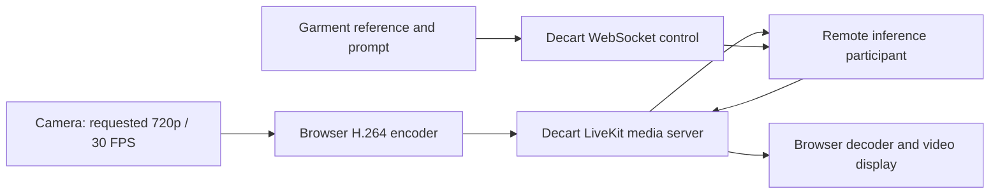
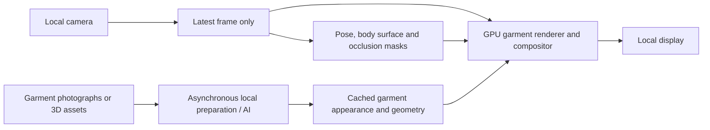

# Fleek: architecture and hardware for a responsive local garment mirror

## Recommendation

Build a local renderer that follows the latest camera pose, with garment preparation and AI refinement running asynchronously. For development, provision **one NVIDIA RTX 5090 with 32 GB VRAM, 128 GB system RAM, a modern 12–16-core CPU, and 2 TB NVMe storage**. This is an engineering starting point for a hybrid mirror and model experiments, not a demonstrated hardware requirement for reproducing Decart Lucy.

A fully generated, photorealistic garment replacement on every frame is a different project. Public evidence does not establish an available local model and hardware combination that reproduces Lucy virtual try-on at 40 ms camera-to-display latency. Achieving that may require a licensed inference engine or model development and distillation. Buying larger GPUs alone does not establish feasibility.

The recommended hybrid approach trades some freedom of fabric deformation and unseen viewpoints for immediate movement. If arbitrary garments, convincing loose fabric, full turns, and exact product details are mandatory together, treat the generative approach as research until it passes a measured prototype.

## What Fleek currently runs

The inspected application is Electron 32, React 18, Vite 5, and TypeScript, using installed `@decartai/sdk` version **0.1.22**. Its live model is `lucy-vton-3.5`. It contains no local Lucy inference engine or weights.

The exact application path is:

| Component | Implementation and consequence |
|---|---|
| Camera | `src/renderer/src/features/camera/useCamera.ts` requests a 1280 × 720, 30 FPS camera stream. These are requested constraints, not proof of actual device output. |
| Garment conditioning | `features/session/composite.ts` combines selected garments into a reference image when starting or changing a selection. This is not a per-video-frame canvas operation. |
| Session | `features/session/decart.ts` connects to Decart with the reference image and prompt; garment changes use the session control channel. |
| Credentials | The client can mint constrained Decart tokens. Electron stores the user's key through its platform storage implementation. |
| Display | The mirror assigns camera and returned streams to video elements. React does not generate the garment or maintain a video-frame queue. |
| Presence | Existing MediaPipe functionality detects presence; it is not a local try-on model. |

The installed SDK separates control from media. REST defaults to `api.decart.ai`; WebSocket control defaults to `api3.decart.ai`. A `livekit_join` exchange returns a room URL and token. The client publishes camera video and subscribes to a participant whose identity begins with `inference-server-`. Default publication uses H.264, simulcast, a 3.5 Mbps maximum bitrate setting, and 30 FPS. The remote participant's internal model, GPU allocation, batching and scheduling cannot be recovered from client code. The source release inspected is [Decart SDK v0.1.22](https://github.com/DecartAI/sdk/tree/v0.1.22), commit `9e90a73927d3d2074aff5dc1fdce48575a15fcd7`.

The original startup failure was a separate packaging problem: Vite prebundling relocated the SDK module without preserving its worker location. The existing Vite configuration changes exclude the SDK from prebundling while including the dependencies that need it. That repair does not remove remote processing latency.

## What the latency evidence establishes

The short instrumented session on 9 September 2026 reported:

| Metric | Observed value |
|---|---:|
| SDK returned-frame median latency | 755–798 ms |
| SDK returned-frame p90 latency | 773–864 ms |
| Time to first returned frame | 4,549 ms |
| Reported WebRTC RTT | 38–42 ms |
| Returned video rate | About 19 FPS |
| Browser encode average | About 13.5 ms in the later samples |
| Browser decode average | About 2.2–2.6 ms |
| Jitter-buffer average | About 30–44 ms |
| Available outgoing bitrate estimate | About 0.87–1.77 Mbps in the later samples |

These are samples from a roughly 13-second live session, not a long-run benchmark. The log is local at `~/Library/Application Support/fleek/renderer.log`. The session showed bandwidth limitation at times, but the measurements cannot assign a percentage of the delay to bandwidth, geography, or inference. They also cannot be subtracted into a reliable server-compute estimate: several fields describe different intervals, overlapping work, or different peer connections.

Two implementation details limit earlier interpretations:

1. The SDK's timestamp trailer is attached in an **encoded-frame transform**. Its advertised glass-to-glass metric is useful for comparing returned-frame age, but is not a complete physical camera-exposure-to-display measurement.
2. The installed stats provider changes map keys to `id#counter`, while the collector resolves candidate references using the original IDs. An isolated reproduction returned one candidate pair from the original stats map and zero through the provider, with the same 38 ms RTT retained. Thus an empty transport list is a diagnostic defect, not evidence that no media connection exists. The collector also picks the largest outbound video layer for some fields; zero FPS there does not prove all simulcast uploads stopped.

The reproduction used synthetic stats and the installed `livekit-stats-provider.js` and `webrtc-stats.js`, without contacting Decart or changing SDK files.

### Is geography the cause?

**Not established.** Decart documents regional media endpoints selected by client geography, plus a US-West media endpoint. It does not document the inference GPU location for this session or prove that the selected media server and inference worker are colocated. A 38 ms media RTT therefore cannot locate the model. The same documentation suggests provisioning 4 Mbps in each direction, with greater headroom for fixed installations; the observed outgoing estimates make network capacity worth testing, but do not isolate the cause. [Decart network requirements](https://docs.platform.decart.ai/integrations/network-requirements).

A conclusive remote diagnosis would need the selected publisher and subscriber routes, inference region, and server timestamps for receive, queue, inference and publish. Client-side measurements alone leave those stages unresolved. A fully local frame path removes dependence on geography regardless of their current contribution.

### What does the approximately 40 ms claim mean?

Decart's XR cookbook assigns approximately 40 ms to **style transfer within a larger pipeline**, including camera capture, encoding, networking, decoding and display; that example describes different models from Fleek's current VTON model. It does not establish a 40 ms end-to-end guarantee for `lucy-vton-3.5`. [Decart XR cookbook](https://cookbook.decart.ai/decart-xr).

Always distinguish four measurements: initial startup, steady output FPS, the age of the movement visible on screen, and garment-change response. A pipeline can output 60 frames every second while showing movements from half a second earlier.

## What can actually be run locally?

Published results below have different models, resolutions, hardware and timing boundaries. They are evidence of capabilities, not directly comparable mirror benchmarks.

| Candidate | Published evidence | Relevance to Fleek |
|---|---|---|
| StreamDiffusion | RTX 4090 / i9-13900K / Ubuntu benchmark reports 93.897 image-to-image FPS for one-step SD-Turbo, and 37.133 FPS for four-step LCM-LoRA + KohakuV2. | Useful fast image-generation baseline. Throughput does not establish physical latency, temporal stability or faithful garment replacement. [Repository](https://github.com/cumulo-autumn/StreamDiffusion). |
| StreamDiffusionV2 | Four H100 GPUs: 64.52 FPS for a 1.3B model or 58.28 FPS for a 14B model; first frame within 0.5 seconds in the reported configuration. | Open streaming-video foundation. It uses causal processing, short video chunks and bounded history. It still needs garment-specific conditioning and evaluation. These numbers are not single-5090 benchmarks. [Project](https://streamdiffusionv2.github.io/), [code](https://github.com/chenfengxu714/StreamDiffusionV2). |
| LiveVVT | At 512 × 384: 1.56-second first chunk, 22.39 FPS sustained, approximately 0.5-second updates. Training uses eight A100 80 GB GPUs; that is not an inference hardware requirement. | Directly relevant garment-specific research, with rolling processing and persistent appearance memory. The August 2026 preprint does not establish a ready-to-deploy 40 ms mirror; a usable code/checkpoint release was not established in this review. [Paper](https://arxiv.org/html/2608.26714v2). |
| CatVTON | Image try-on with under 8 GB VRAM at 1024 × 768 in its documented configuration. | Candidate for asynchronous reference preparation, not proven live per-frame use. The repository specifies a noncommercial license, so it is not a drop-in commercial dependency. [Repository and license statement](https://github.com/Zheng-Chong/CatVTON). |
| Decart Lucy VTON | Hosted SDK integration is available. | No publicly downloadable local VTON weights or supported local deployment package was established from the reviewed material. A vendor-provided engine would need its own deployment terms and benchmark. [VTON documentation](https://docs.platform.decart.ai/models/realtime/virtual-try-on). |

## Recommended local design

### Fast loop: current motion drives every displayed frame

Capture directly into GPU-accessible buffers where supported. Timestamp each frame at the earliest available capture boundary. Use a latest-frame mailbox: when processing falls behind, replace the pending frame instead of building a queue.

Estimate body pose, garment region and foreground occlusion. Hands, arms, hair and accessories must be composited in the correct order. Landmarks alone are insufficient for sleeve outlines and crossed arms. A lightweight pose model is one component; MediaPipe's web documentation also warns that synchronous detection blocks the calling thread, so browser-based tracking belongs in a worker. [Pose Landmarker documentation](https://developers.google.com/edge/mediapipe/solutions/vision/pose_landmarker/web_js).

Render a deformable garment mesh, texture or layered surface using the newest pose. Keep the current camera face and background. Use optical flow or tracking to bridge between more expensive estimates. Maintain timestamps on masks and geometry so that stale tracking cannot silently accumulate.

Start with one upper-body garment and bounded front-facing movement. For full turns and convincing drape, prefer prepared 3D garment assets with material and shape information. A single catalog photograph does not provide the hidden back surface or physical cloth properties; AI can invent them, but cannot establish their accuracy.

### Slow loop: prepare appearance without delaying motion

On garment selection, prepare masks, textures, reference embeddings and optionally generated keyframes. Cache these results. Run expensive refinement at lower priority or when pose changes enough to justify it. Reproject accepted results onto the current pose; do not simply display an old generated full frame, which would restore the movement delay.

Reject outdated refinement results using source timestamps and garment IDs. Fade in an updated appearance only when it is compatible with current geometry. A second GPU is an option if refinement competes with the fast loop, but profiling should establish that need first.

This design can produce a responsive mirror, but realistic fabric motion and large viewpoint changes remain its central quality risks. Its feasibility should be judged with actual garments, not generic stylization demos.

### If every frame must be generated

Use a camera-conditioned causal video model, garment-reference conditioning and explicit preservation of identity and background. Minimize temporal lookahead and denoising steps; bound temporal memory; precompute garment features. Evaluate reduced precision, compiled graphs and supported TensorRT kernels against the exact architecture. These are candidate optimizations, not automatic speedups.

Do not choose a clip generator merely because its throughput exceeds 30 FPS. Waiting for future frames or a whole output chunk can consume the latency budget before presentation begins. Model adaptation, garment data and distillation may be the dominant work. Training infrastructure is separate from the machine that eventually serves one mirror.

### Application integration

Retain Fleek's wardrobe, camera controls and session UI. Introduce a render-engine interface with local and Decart implementations. The local engine should expose start, stop, garment update, output surface and timestamped performance metrics. Decart generation events and usage accounting should remain specific to the remote engine.

Use a native GPU worker for inference and rendering, with Electron as the control interface. Prefer shared GPU textures; use bounded shared-memory buffers if texture sharing is impractical. A loopback API can carry commands and status. Avoid per-frame base64 images, HTTP uploads or streaming-video segment buffers inside a single machine. Measure any unavoidable copies and presentation overhead.

OpenAI can help with garment descriptions or offline asset preparation. It cannot supply the local live-rendering loop: the documented `gpt-realtime` model has image input, but no video modality support or transformed-video output. Remote API calls must stay outside the frame deadline; preload their results if the mirror must operate offline. [OpenAI model documentation](https://developers.openai.com/api/docs/models/gpt-realtime).

## Hardware planning

These tiers are **engineering planning estimates for one camera and one mirror**, except where a published benchmark is explicitly identified.

| Purpose | GPU and host | What it establishes |
|---|---|---|
| Tracked rendering with prepared assets | Modern discrete GPU with roughly 12–16 GB VRAM; 32–64 GB RAM; modern 8+ core CPU | Starting budget for tracking, masks and rendering. Actual needs depend on models, geometry and resolution; no diffusion performance guarantee. |
| Recommended development workstation | **RTX 5090 32 GB**, **128 GB RAM** preferred, modern **12–16-core CPU**, **2 TB NVMe** | Room for a hybrid prototype and smaller generative experiments. 64 GB RAM may suffice for a narrower runtime. Single-card Lucy-equivalent latency is unproven. |
| Larger-model investigation | **RTX PRO 6000 Blackwell 96 GB**, 128–256 GB RAM | More model and activation capacity. More VRAM does not imply proportionally lower frame latency. |
| Multi-GPU research reference | Four H100 GPUs with an appropriate high-bandwidth interconnect and server platform | Matches the GPU count of the cited StreamDiffusionV2 results. It is not a proven 40 ms garment mirror or a default procurement recommendation. |

NVIDIA confirms the [5090's 32 GB specification](https://www.nvidia.com/en-us/geforce/graphics-cards/50-series/rtx-5090/) and the [RTX PRO 6000's 96 GB specification](https://www.nvidia.com/en-us/products/workstations/professional-desktop-gpus/rtx-pro-6000/). H100 variants differ; the [H100 specifications](https://www.nvidia.com/en-eu/data-center/h100/) list 80 GB for SXM and 94 GB for NVL. Match the benchmark's actual configuration rather than treating all H100 systems as interchangeable.

Use a Linux workstation with driver, CUDA, PyTorch and acceleration-library versions pinned to the selected model's supported configuration. Blackwell compatibility must be tested across the entire dependency stack. Size the PSU, case and cooling around the complete workstation; NVIDIA lists 575 W graphics power and 1000 W required system power for the reference 5090 configuration, so an integrator should validate additional CPU and peripheral headroom.

Use a low-buffering USB 3 camera supporting 1080p at 60 FPS, a 120 Hz low-latency display, and adequate lighting to prevent long exposures. Begin inference at a lower working resolution and measure upscale cost separately. An optional depth camera may improve geometry and occlusion, but is not required for the first prototype. Capture devices, exposure settings and display processing can defeat an otherwise fast GPU pipeline.

## Benchmark before procurement or a full rewrite

The first experiment should run the chosen model and renderer on a borrowed or rented matching GPU. Remote GPU access can test compute time and memory, but the final physical latency test needs the camera, compute and display together.

Use the following **acceptance goals, not promised results**:

| Measurement | Initial target |
|---|---|
| Physical movement-to-display delay | Median below 80 ms; p95 below 120 ms for the hybrid path |
| Fresh rendered output | At least 30 FPS; display refresh measured independently |
| Queue behaviour | At most one pending camera frame; no increasing frame age |
| Sustained operation | At least ten minutes with no growing latency or thermal slowdown |
| Visual quality | Crossed arms, rapid turns, sitting, patterned fabric and garment changes evaluated separately |
| Offline operation | After assets are loaded, network disconnected without interruption to live motion |

Measure physical latency with a high-speed camera filming both a visible movement or light transition and its screen representation. Software timestamps should separately cover capture, tracking, inference, composition and presentation. Report distributions, not only average FPS. Record startup and garment-change time independently from steady motion latency.

The decision gate is straightforward: choose the hybrid renderer if it meets the visual requirements and physical latency target. If its quality is insufficient, benchmark a garment-conditioned causal model or obtain a vendor-supported local engine before specifying production GPU quantities. There is currently no evidence-backed basis for promising that a particular GPU purchase alone will turn Fleek into a 40 ms fully generative mirror.

## Evidence scope and source inventory

Reviewed 9 September 2026. Application findings come from the Fleek checkout, installed SDK 0.1.22 and the local session log. Public architecture beyond the client/server boundary remains undisclosed. The linked sources above comprise the evidence inventory: Decart SDK, network requirements, XR cookbook and VTON docs; StreamDiffusion, StreamDiffusionV2, LiveVVT and CatVTON primary publications or repositories; Google pose documentation; OpenAI model documentation; and NVIDIA hardware specifications. All proposed architecture, hardware budgets and acceptance thresholds are engineering recommendations rather than vendor guarantees.
